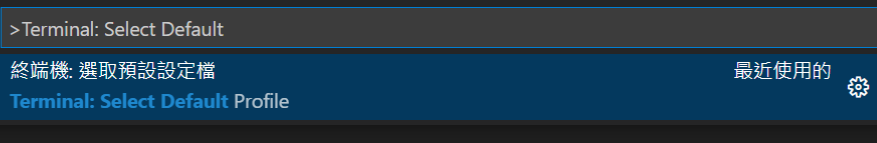

# VS Code 設定筆記

>碰到有趣的會陸續更新...  

工欲善其事必先利其器，VS Code 輕薄短小擴充性高，像是一把隨身攜帶自由組裝的瑞士軍刀!  

## 快速鍵

身為菜ㄐ我常用的快捷鍵只有幾個XD

| Keyboard shortcuts           | windows             | Mac       |
| ---------------------------- | ------------------- | --------- |
| 移動整行字串                 | ALT + ↑ / Alt + ↓   | ⌥↓ / ⌥↑   |
| 複製整行(向上貼上或向下貼上) | Alt + Shift + ↑ / ↓ | ⇧⌥↓ / ⇧⌥↑ |
| 整行註解                     | Ctrl+/              | ⌘/        |
| 自動整理格式                 | Shift+Alt+F         | ⇧⌥F       |
| 開啟終端機                   | Ctrl + \`           | ⌃\`       |
| 建立新的終端機               | Ctrl + Shift + \`   | ⌃⇧`       |

VS Code 官方快速鍵PDF：[Windows](https://code.visualstudio.com/shortcuts/keyboard-shortcuts-windows.pdf) | [MacOS](https://code.visualstudio.com/shortcuts/keyboard-shortcuts-macos.pdf)  

Visual Studio Code 官方快捷鍵使用技巧 [VS Code Tips and Tricks - Keyboard Reference Sheets](https://github.com/Microsoft/vscode-tips-and-tricks#keyboard-reference-sheets)

## 設定預設終端機

使用快速鍵 `Ctrl + Shift + P` 叫出選單  
輸入 `Terminal: Select Default` 應該會跑出 `終端機:選取預設設定檔`

點下去!   
會跳出你目前有的shell選項，選想要的預設終端機就完成啦~  

現在可以用快速鍵 ` Ctrl + Shift + 反引號 ` 把終端機叫出來，應該會出現剛剛選的預設選項了!

## Auto Rename Tag

自動補完HTML前後包的tag，省去很多麻煩! 終於不用一個一個縮排縮起來找了~

